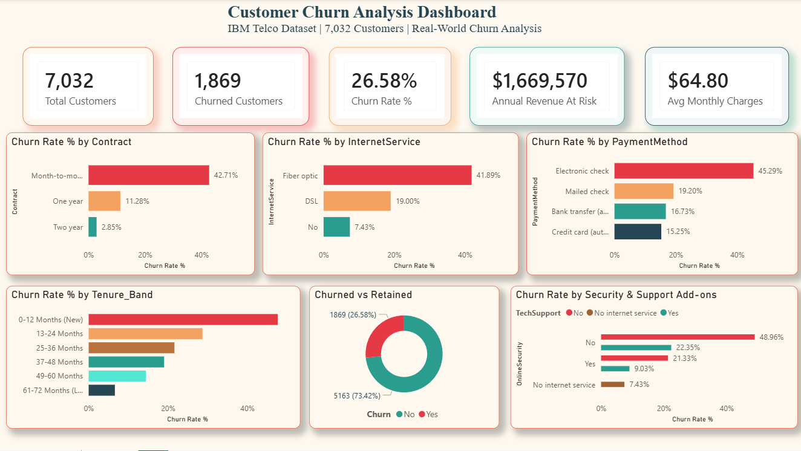

# 📊 Customer Churn Analysis
### Tools: Excel | MySQL | Power BI
### Dataset: IBM Telco Customer Churn | 7,032 Real Customers | Source: IBM Watson Analytics

---

## 📸 Dashboard Preview

---

## 🎯 The Business Problem

A telecom company is experiencing a **26.58% customer churn rate** — significantly above the industry average of 15-20%. The business is losing an estimated **$1,669,570 in annual recurring revenue** to churned customers.

**As the analyst, I was tasked with answering:**
- Who is churning and why?
- Which customer segments are highest risk?
- What is the financial impact?
- Which customers should the retention team target first?

---

## 📁 Repository Files

| File | Description |
|------|-------------|
| `Project2_Telco_Churn_Dashboard.pbix` | Full interactive Power BI dashboard |
| `Project2_Telco_Churn_IBM.csv` | Cleaned dataset used for SQL import |
| `Project2_Telco_Churn_IBM.xlsx` | Excel workbook — Data Dictionary, Cleaning Log, 5 Analysis tables |
| `Telco_Churn_Queries.sql` | All 12 MySQL queries with business context comments |
| `Customer_Churn_Analysis_Telco.png` | Dashboard screenshot |

---

## 📊 Dataset

| Detail | Value |
|--------|-------|
| Source | IBM Watson Analytics Sample Dataset |
| Rows | 7,032 customers (after cleaning) |
| Columns | 21 |
| Churn Rate | 26.58% |
| Revenue At Risk | $1,669,570 annually |

---

## 🔧 What I Built

### 1️⃣ Data Cleaning — Excel
- Identified **2 genuine data quality issues** in the real IBM dataset
- **Issue 1:** TotalCharges stored as text — converted to numeric using Text to Columns
- **Issue 2:** 11 customers with tenure = 0 and blank TotalCharges — removed as unanalyzable
- Documented all findings in a structured cleaning log with severity ratings
- Built a complete Data Dictionary for all 21 columns

### 2️⃣ Analysis — Excel
Built 5 analytical tables using COUNTIF, COUNTIFS and AVERAGEIF:
- Churn rate by contract type
- Churn rate by internet service
- Churn rate by payment method
- Churn rate by tenure band
- Impact of add-on services (OnlineSecurity, TechSupport) on churn

### 3️⃣ SQL Queries — MySQL (12 Queries)

| # | Difficulty | Business Question |
|---|-----------|-------------------|
| 1 | Beginner | Overall churn rate |
| 2 | Beginner | Total annual revenue at risk |
| 3 | Beginner | Churn rate by contract type |
| 4 | Beginner | Churn rate by payment method |
| 5 | Intermediate | Churn rate by internet service |
| 6 | Intermediate | Churn rate by tenure band |
| 7 | Intermediate | Impact of TechSupport on churn |
| 8 | Intermediate | Avg charges — churned vs retained |
| 9 | Advanced | Rank top risk factors — RANK() window function |
| 10 | Advanced | Retention target list — high risk, not yet churned |
| 11 | Advanced | Customer Lifetime Value by contract type |
| 12 | Advanced | Deadliest churn combination — GROUP BY + HAVING |

### 4️⃣ Power BI Dashboard
- **5 KPI Cards** — Total customers, churned, churn rate, revenue at risk, avg charges
- **Churn by Contract** — Month-to-month vs One/Two year comparison
- **Churn by Internet Service** — Fiber optic vs DSL vs No internet
- **Churn by Payment Method** — Electronic check vs automatic methods
- **Churn by Tenure Band** — New vs loyal customer risk profile
- **Churned vs Retained** — Donut chart showing 26.58% vs 73.42% split
- **Add-on Services Impact** — OnlineSecurity and TechSupport churn comparison

---

## 🔍 Key Findings

### 1. Contract Type is the #1 Driver
> Month-to-month customers churn at **42.71%** vs just **2.85%** for two-year contracts — a **15x difference**

### 2. New Customers Are the Highest Risk
> Customers in their first 12 months churn at **47.68%** — the highest of any group

### 3. Electronic Check is a Churn Signal
> Electronic check customers churn at **45.29%** vs **15.25%** for credit card — a **3x difference**

### 4. Add-on Services Are Protective
> Customers without OnlineSecurity churn **27% more** | Without TechSupport churn **26% more**

### 5. The Deadliest Customer Profile
> **Month-to-month + Fiber optic + Electronic check = 60.37% churn rate** — more than double the company average

### 6. Actionable Retention Target List
> SQL Query 10 identified **20 high-value customers** matching every churn risk factor who haven't left yet — representing ~$85,000 in recoverable annual revenue

---

## 💡 Business Recommendation

> Target Month-to-month Fiber optic customers in their first 12 months who pay by Electronic check and have no OnlineSecurity or TechSupport. Offering a discounted upgrade to a One Year contract bundled with OnlineSecurity could reduce this segment's churn rate from 60% to under 20% — potentially recovering over **$400,000 in annual recurring revenue.**

---

## 🛠️ Skills Demonstrated

`Data Cleaning` `COUNTIFS` `Window Functions` `CTEs` `Churn Analysis` `Customer Segmentation` `Revenue Impact Analysis` `Retention Strategy` `DAX` `Real-World Data`

---

## 🔗 Connect

- 💼 [LinkedIn](https://www.linkedin.com/in/ankur-sharma-37a0a3276/)
- 🐱 [GitHub](https://github.com/SphinX-2738)
- 📧 ankursharma.099550@gmail.com
